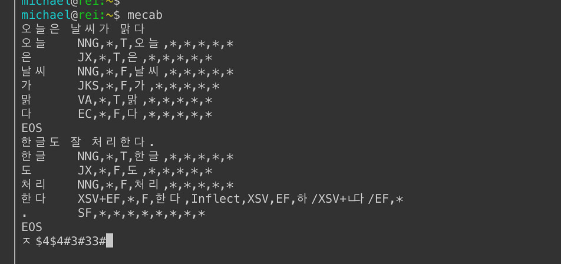

<h2>야 너도 만들 수 있어, 검색기능</h2>

본격, 검색이 쉽다고 약파는 발표!

<h3 style="margin:0px;padding:0px">AWSKRUG Architecture Org.</h3>
<h3 style="margin:0px;padding:0px">댕근마켓 검색팀 조용진</h3>
<h5 style="margin:0px;padding:0px">dydwls121200@gmail.com</h5>

---

## 검색 엔진 = 데이터베이스 엔진

- 검색엔진은 어렵지 않다. 그냥 데이터 베이스다
- 고작해봐야 데이터를 넣고, 데이터를 가져온다. 그리고 정렬해서 밷는다.
- 응?

---

## 조금 더 복잡하게 보면
## 아래 이미지와 같겠죠?

    

---

## 3분 elasticsearch 소개

    

---

## 검색엔진 필수지식 포인트 세 가지
- 데이터구조
    - 어떻게 저장하고 어떻게 가져올까?
- 소팅 알고리즘
    - 가져는 왔는데, 어떻게 정렬할까?
- 형태소분석기
    - 한글이라 그런데, 어떻게 형태소를 분리해야할까?

---

## 검색엔진 원리의 필수 지식
### 1. 데이터 구조

- 기억해! `Inverted Index` 역색인 구조
- 단어가 key값인 데이터 구조

    

---

## 검색엔진 원리의 필수 지식
### 2. 랭킹 알고리즘

- 기억해!! TD-IDF
- (Term Frequent - Inverse Doc. Freq.)

    

- 전체 문서들에서 **많이 등장하는 단어**가 하나의 문서에서 등장하면 **점수 안 줌**!
- 전체 문서들에서 **자주 등장하지 않는 단어**가 하나의 문서에서 많이 등장하면 **점수 많이 줌**!

---

## 검색엔진 원리의 필수 지식
### 2. 랭킹 알고리즘

- 기억해!! TD-IDF
- (Term Frequent - Inverse Doc. Freq.)

    

- 전체 문서들에서 **많이 등장하는 단어**가 하나의 문서에서 등장하면 **점수 안 줌**!
- 전체 문서들에서 **자주 등장하지 않는 단어**가 하나의 문서에서 많이 **점수 많이 줌**!

---

    

안읽어도 됨 (아는척 하려고 써봄)
1. w(word) 는 김치
2. tf(Term Frequency): 하나의 문서에서 김치라는 term이 등장한 횟수
3. idf(Inverse of Document Frequency): log(전체문서수 분의 김치라는 term 포함된 문서 수)
4. 한 문서에서 김치라는 단어가 등장한 희귀한 키워드일 수록 검색랭킹에서 우의를 점할 수 있다.
5. 4번의 꼼수때문에 나온 알고리즘이 [BM25](https://blog.naver.com/duqrlwjddns1/221782081265).

---

## 검색엔진 원리의 필수 지식
### 3. 형태소 분석기

- 기억해! 한글 단어를 품사대로 쪼사버리는거야!
- `오늘은 날씨가 맑다` -> `오늘`, `은`, `날씨`, `가`, `맑다`
- 다 쪼사버려!

    

---

## 필수 지식 3개가 들어간 프로그램?

#### Elasticsearch, OpenSearch

- Lucene이나 Solr는 비추.
- Lucene을 쓰는건 baremetal을 쓰는것 같은 느낌
- Solr를 쓰는것은 게임회사가 아닌데 C#으로 써버 짜자는 느낌
- OpenSearch 를 쓰던 Elasticsearch 를 쓰던 상관없어. 똑같아.

---

## elasticsearch 개념 설명

- lucene 쓰지 말라는 이유 => ES안에 Lucene이 이미 있음.

    
    

---

## elasticsearch 개념 설명

    
    

- cluster: elasticsearch 여러개
- node: cluster 를 이루는 elasticsearch 하나
- index: DB table
- shard: Lucene
- field: Column
