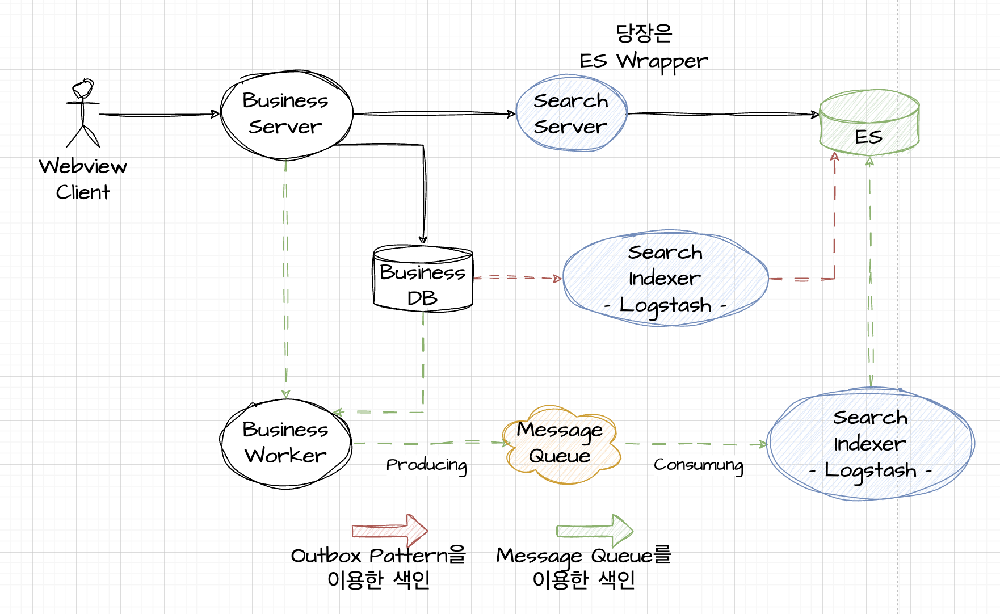

## 그럼 검색시스템을 한번 만들어보자

아래 3개만 집중해본다.
- 저장한다
- 찾는다
- 정렬한다

---

## 쉽다 쉬워~ 저장하기

Outbox Pattern

---

## 쉽다 쉬워~ 저장하기

Event Queue Pattern

---

## 쉽다 쉬워~ 저장하기

- Outbox Pattern & Event Queue Pattern

---

## 쉽다 쉬워~ 저장하기
#### trade off

- 시간이 없다면
  - outbox pattern으로 fluentd, logstash로 DB, File 들을 일정한 주기로 꺼내 읽어 색인한다.
- 시간이 있다면
  - message queue에다가 색인할 문서를 넣어두고 색인 플랫폼에서는 꺼내서 색인할 수 있도록 한다.

---

## 쉽다 쉬워~ 저장하기
#### trade off

- 초당 읽어야하는 트래픽이 많다면
  - outbox pattern으로 fluentd, logstash로 DB, File 들을 일정한 주기로 꺼내 읽어 색인한다.
- 초당 읽어야하는 트래픽이 적다면
  - message queue에다가 색인할 문서를 넣어두고 색인 플랫폼에서는 꺼내서 색인할 수 있도록 한다.
지 모르니까. 어떻게 쪼개도록 해야할지 모르니까. 이 모르는것에 대해 퀄리티를 보정해야하니까