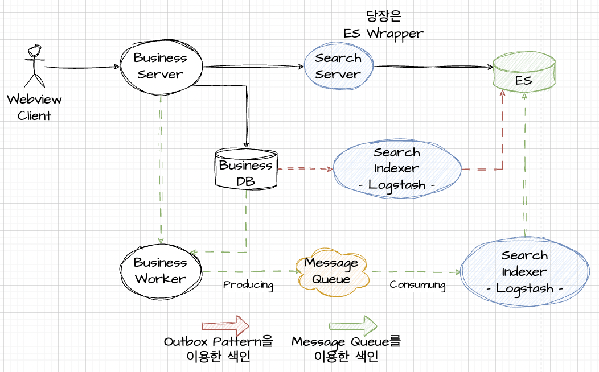
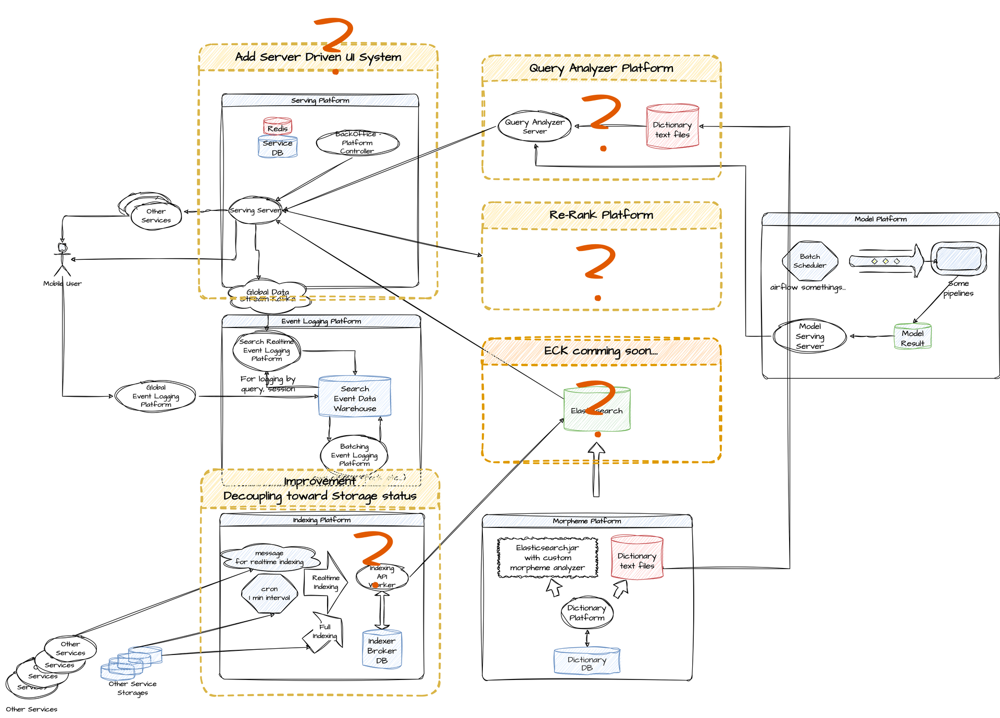
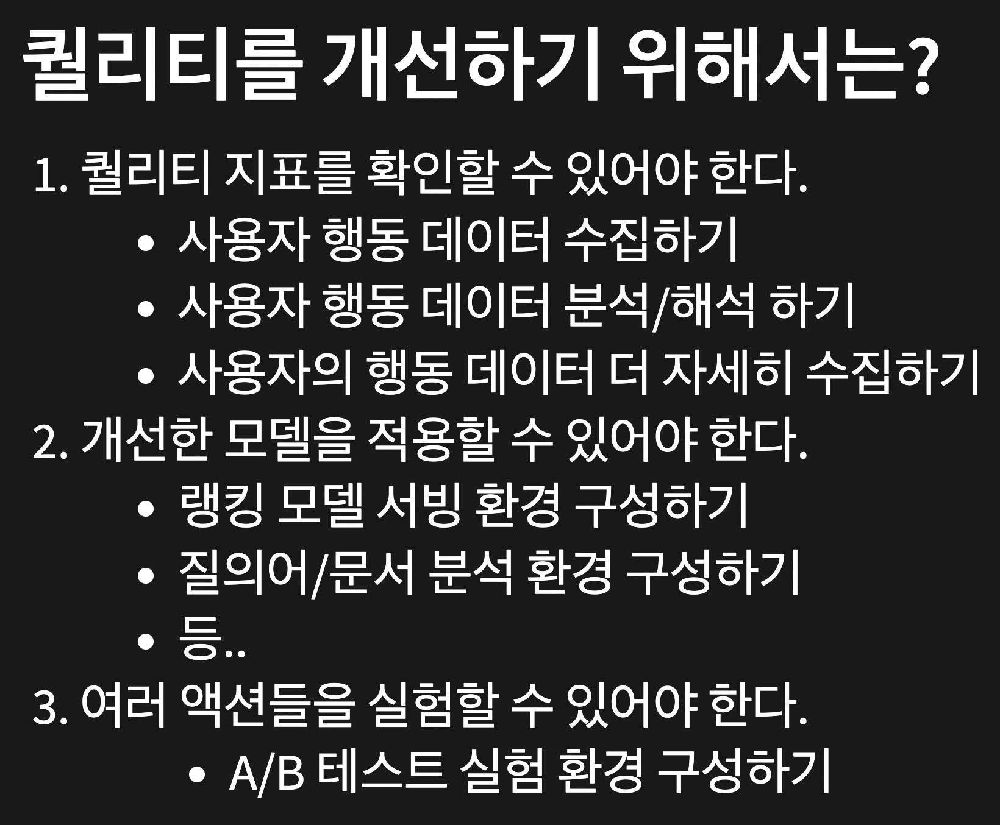

## 쉽게 대충 만들어보면
## 다음과 같은 그림이 나온다

    

---

## 처음 봤던 복잡한
## 이미지에 도달해버렸다.

    

---

## 그런데 이전에 당근마켓은
## 대충 이렇다는데..!?

    

---

## 하지만 검색은 왜 어려울까?

바로 퀄리티를 관리해야하기 때문

- 검색 서비스로의 퀄리티
- 검색 결과의 퀄리티
- 검색 데이터의 퀄리티

---

## 퀄리티를 개선하기 위해서는?

1. 퀄리티 지표를 확인할 수 있어야 한다.
   - 사용자 행동 데이터 수집하기
   - 사용자 행동 데이터 분석/해석 하기
   - 사용자의 행동 데이터 더 자세히 수집하기
2. 개선한 모델을 적용할 수 있어야 한다.
   - 랭킹 모델 서빙 환경 구성하기
   - 질의어/문서 분석 환경 구성하기
   - 등..
3. 여러 액션들을 실험할 수 있어야 한다.
  - A/B 테스트 실험 환경 구성하기

---

    

## 잠깐.. 이게 비단.. 
## 검색만의 이야기 일까?

## 하나를 알면
## 열은 몰라도! 둘은 안다!

---

## 퀄리티 개선은
## 서비스의 개선

- 피드, 검색, 알림 다 똑같음
- 단, 각 기능별 목적이 다름 (탐색? 목적? 알림?)
- 목적에 따른 퀄리티 개선이 이루어짐
- 검색/서비스/도메인을 이해해야 개선 가능
- 위 서비스들의 꽃은 퀄리티 개선

---

## 퀄리티를 개선하는것보다
## 당장에 검색기능을 두는거라면?

# 🐶🍯 쉽다

---

## 아무도 알려주지 않은 핵 꿀팁

#### 🚨(서비스가 미성숙 한 단계만 쓸 수 있음.) 🚨
검색의 퀄리티를 자체들을 신경쓰기전에 먼저 봤으면 좋겠어서 먼저 슬쩍 언급해봄

- 형분기가 키워드를 잘게 쪼사버리도록 형분기를 만든다.
- 그래야 검색어에 따른 문서 탐색 대상이 많아지게 된다.
- 잘 모르겠다면 정확도 순 + 최신 순 정렬만 쓴다.
  - 왠만하면 이게 정답이다.

---

## 아무도 알려주지 않은 핵 꿀팁

#### 🚨(서비스가 미성숙 한 단계만 쓸 수 있음.) 🚨
- 검색어에 따른 문서 결과가 상위에 올라오지 않더라도 괜찮다.
  - 사용자는 생각외로 검색결과가 별로네, 하면서도 쓰긴 한다.
    - 검색사용자는 목적형 탐색이 대부분이니 스크롤 몇 번 해서라도 찾아간다.
  - 스크롤 한 두번 사이에 결과가 나오기만 해도 된다.
  - 일단 문서가 많이 노출되니까 전환은 되긴 된다.
- 덤으로 검색횟수와 세션 유지시간이 늘어나서 마치 검색엔진이 잘 돌아가는것처럼 보인다. ^^
